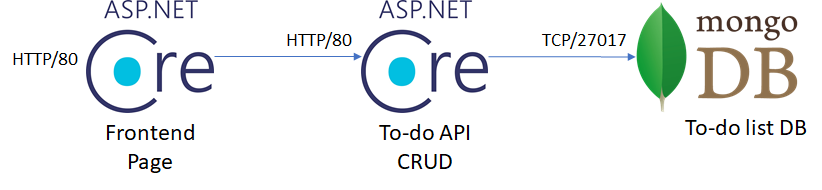

# AKS Workshop
This is a walkthrough to create an Azure Kubernetes Service cluster in a production-like situation. It focuses in the following cases:

* Set up a virtual network for multiple workloads
* Set up a service principal to be used by the AKS cluster
* Use Helm to install pre-built packages and custom releases
* Connect the AKS cluster with a private Azure Container Registry
* Configure an ingress controller to an internal virtual netwok IP
* Expose the application to the Internet using an Azure App Gateway

## Pre-requisites

> [!NOTE]
    > You can choose not to install any CLI on your computer and either create an [Azure data Science VM](https://docs.microsoft.com/en-us/azure/machine-learning/data-science-virtual-machine/provision-vm), or use the [Azure Cloud Shell](https://shell.azure.com).

* Docker [download](https://docs.docker.com/docker-for-windows/install/)
* MongoDB Compass Community [download](https://docs.mongodb.com/compass/master/install/)
* Install VS Code [here](https://code.visualstudio.com/download)
* Install Azure CLI [here](https://docs.microsoft.com/en-us/cli/azure/install-azure-cli?view=azure-cli-latest)
* Install Azure AKS CLI [here](https://docs.microsoft.com/en-us/cli/azure/aks?view=azure-cli-latest#az-aks-install-cli)
* Install Helm [here](https://helm.sh/docs/using_helm/#installing-helm)

* Clone this repo, ```git clone https://github.com/marvin-garcia/AksWorkshop.git```

## Create virtual network

By default, AKS clusters use [kubenet](https://kubernetes.io/docs/concepts/cluster-administration/network-plugins/#kubenet) to create the virtual network and subnet, but that is rarely the case in real life scenarios. Most of the times the cluster will need to coexist and interact with other services and more importantly, be governed by company networking policies. The alternative is to use [Azure Container Networking Interface (CNI)](https://docs.microsoft.com/en-us/azure/aks/configure-azure-cni), where the cluster requires an existing virtual network and subnet to be allocated. This requires the virtual network address space to be carefully planned in advance. You can read more about configuring Azure CNI [here](https://docs.microsoft.com/en-us/azure/aks/configure-azure-cni).

In this lab we are going to create an address space like the following:


> [!NOTE] 
    > The scope of this lab does not include the Network Security Groups between the subnets, but they should be considered in a production environment.


1. Before you can start creating resources, you must log in to your Azure account:

  ```powershell
  az login
  az account set --subscription <your subscription name>

  #create resource group
  az group create --name <your rg name> --location <your location>
  ```

2. Run the script to create the virtual network [create-vnet.ps1](Scripts/create-vnet.ps1).

## Create Application Gateway

The app Gateway will be the gate to your cluster, it will receive incoming traffic from the Internet, will provide SSL termination if you configure it with an SSL certificate, and will redirect traffic to any internal IP address as long as it can reach out to it. You won't need the gateway right away, but because it takes some time to create it's better to do it at this point and configure its settings later. Run the script [create-app-gateway.ps1](Scripts/create-app-gateway.ps1), make sure to fill in the parameters and comment out the parameter ```--servers``` since we don't know the cluster's IP yet.

## Create AKS cluster

1. First you need to create a service principal to manage the cluster's resources. Run the script [create-service-principal.ps1](Scripts/create-service-principal.ps1). You can read more about creating AKS cluster with existing service principals [here](https://docs.microsoft.com/en-us/azure/aks/kubernetes-service-principal).

> [!NOTE] 
    > Make sure to write down the App Id and secret somewhere safe during the remaining of this exercise, since we will need it in a minute.

2. Now that you have created the service principal, you need to grant the service principal Contributor access to the virtual network. This is so the service principal can create new nodes in the virtual network. Run the script [grant-sp-vnet-access.ps1](Scripts/grant-sp-vnet-access.ps1).

3. Run the script [create-aks.ps1](Scripts/create-aks.ps1) to create the AKS cluster You can read more about the command az aks create [here](https://docs.microsoft.com/en-us/cli/azure/aks?view=azure-cli-latest#az-aks-create).

4. Once the cluster has been created, Download the credentials to your cluster by running the script [get-aks-credentials.ps1](Scripts/get-aks-credentials.ps1).

## Create Container Registry

5. Create a Container Registry to own the Docker images. Run the script [create-acr.ps1](Scripts/create-acr.ps1). You will need to ensure the cluster can pull images from your registry, there are two ways of accomplishing this task: Create a secret object in the cluster with the container registry key, or grant the service principal pull access to the registry. In this case we will do the latter, run the script [grant-aks-acr-access.ps1](Scripts/grant-aks-acr-access.ps1).

6. Log in to the contrainer registry, go to the Azure portal and find the login server, username and one of the keys. Then run the command ```docker login <login-server> -u <username> -p <password>```.
<br /><br />


## Deploy MongoDB

7. For this project you will need an instance of MongoDB in the cluster. The recommended way of doing so is using Helm. Helm is a Kubernetes package manager and it has a MongoDB chart that is replicated and horizontally scalable. Because the cluster was created with RBAC enabled, you have to create the appropriate ServiceAccount for Tiller (the server side Helm component) to use. Run the script [helm-init.ps1](Scripts/helm-init.ps1).

8. Deploy a highly available instance of MongoDB in the cluster. Run the script [helm-install-mongo.ps1](Scripts/helm-install-mongo.ps1). Take note of the MongoDB service FQDN, you will need it later in the lab. Follow the instructions in the output to connect to the database from outside the cluster, then use MongoDB Compass Community to create a database and a collection.

## Deploy Backend API

9. Pull the Backend API docker image and push it to your registry:
    ```powershell
    docker pull aksworkshopregistry.azurecr.io/aksworkshop/backend-api
    docker tag aksworkshopregistry.azurecr.io/aksworkshop/backend-api <you-login-server>.azurecr.io/aksworkshop/backend-api
    docker push <you-login-server>.azurecr.io/aksworkshop/backend-api
    ```

10. Create a deployment and service YAML files for the backend API. It should comply with the following requirements:
    * At least 2 replicas
    * Liveness and readiness probes pointing to the swagger page (/swagger/index.html)
    * Resources requests and limits
    * The following environment variables:
        * mongodb: connection string to the MongoDB
        * mongodatabase: database name
        * mongocollection: collection name
        * ApplicationInsights__InstrumentationKey: instrumentation key for an Application Insights resource
    * Must not be exposed to the Internet.

11. Create the deployment and service in the cluster. You may use the command ```kubectl apply```, Helm charts or Azure DevOps to manage the release. If you have time constraints, just use the [templates](MultitierApi/BackendApi/Helm/) provided in this lab. It is recommended to use [Azure DevOps](DevOps/README.md) since releases will be automated that way. You can also use the script [helm-create-release.ps1](Scripts/helm-create-release.ps1) to push releases manually to the cluster.

12. Use the command ```kubectl port-forward``` to test the Backend API using the Swagger page.
    ```powershell
    kubectl port-forward --namespace default svc/<backend-service-name> 8080:80;
    ```

## Deploy Frontend API

13. Pull the Frontend API docker image and push it to your registry:
    ```powershell
    docker pull aksworkshopregistry.azurecr.io/aksworkshop/frontend-api
    docker tag aksworkshopregistry.azurecr.io/aksworkshop/frontend-api <you-login-server>.azurecr.io/aksworkshop/frontend-api
    docker push <you-login-server>.azurecr.io/aksworkshop/frontend-api
    ```

14. Install an internal instance of nginx in the cluster using Helm. By default, an NGINX controller is created with a dynamic public IP address assignment. To assign a private IP within your virtual network you will need a YAML file like [ingress-internal.yaml](Templates/ingress-internal.yaml). Make sure to provide your own IP address, and use one that has not yet been assigned. Run the script [helm-install-nginx-internal.ps1](Scripts/helm-install-nginx-internal.ps1).
    > [!HINT] 
    > Check the cluster resource group and notice that a new load balancer with an internal IP address was created.

15. Create a deployment, service and ingress controller YAML files for the frontend API. It should comply with the following requirements:
    * At least 2 replicas
    * Liveness and readiness probes pointing to the swagger page (/swagger/index.html)
    * Resources requests and limits
    * The following environment variables:
        * backendurl: FQDN for the backend service
        * ApplicationInsights__InstrumentationKey: instrumentation key for an Application Insights resource
    * Must not be exposed to the Internet.

16. Create the deployment and service in the cluster. You may use the command ```kubectl apply```, Helm charts or Azure DevOps to manage the release. If you have time constraints, just use the [templates](MultitierApi/Helm/) provided in this lab. It is recommended to use [Azure DevOps](DevOps/README.md) since releases will be automated that way. You can also use the script [helm-create-release.ps1](Scripts/helm-create-release.ps1) to push releases manually to the cluster.

17. Use the command ```kubectl port-forward``` to test the Frontend API using the Swagger page.
    ```powershell
        kubectl port-forward --namespace default svc/<frontend-service-name> 8080:80;
    ```

## Configure App Gateway

18. Now that you have a frontend service using the internal IP from the ingress controller, you can go back to the App Gateway and finish its configuration.
    a. Go to the App Gateway resource in the Azure portal.
    b. Create an HTTP setting with all its default values. Make sure it uses port 80.
    c. Create a backend pool of the type **IP Address or FQDN**, add the ingress controller's IP address and assign the rule you jsut created.
    e. Try accessing the App Gateway's public IP via HTTP, you should get to the frontend's home page.

## Next Steps

At this point it is up to you if you want to play any further with the App Gateway to check SSL termination and firewall settings to protect your application, or if you want to create your own firewalls (ie: Palo Alto) inside the virtual network and redirect traffic to them.

You can also try creating NSGs for every subnet and isolate traffic to specific sources. For example you could allow access to the cluster network only from the App Gateway subnet and deny everything else, and you can whitelist the external IP addresses that can reach out to your App Gateway for additional security.
